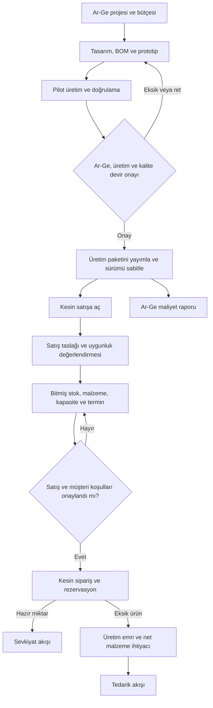
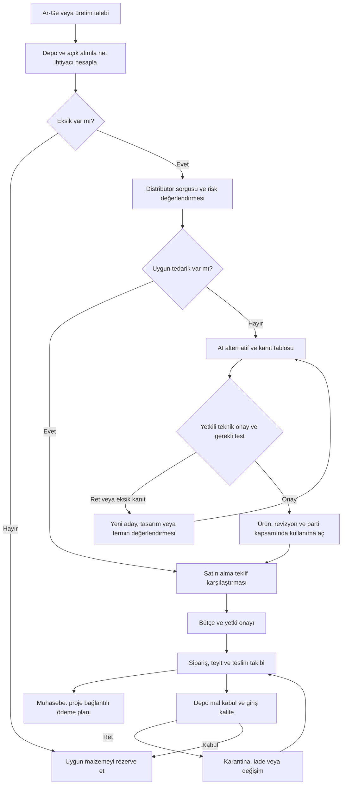
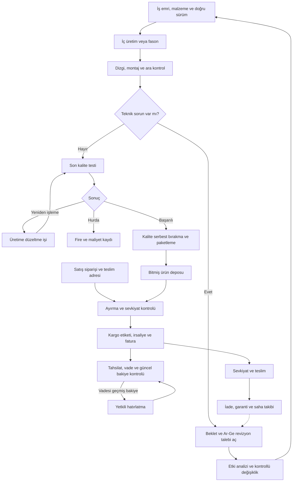
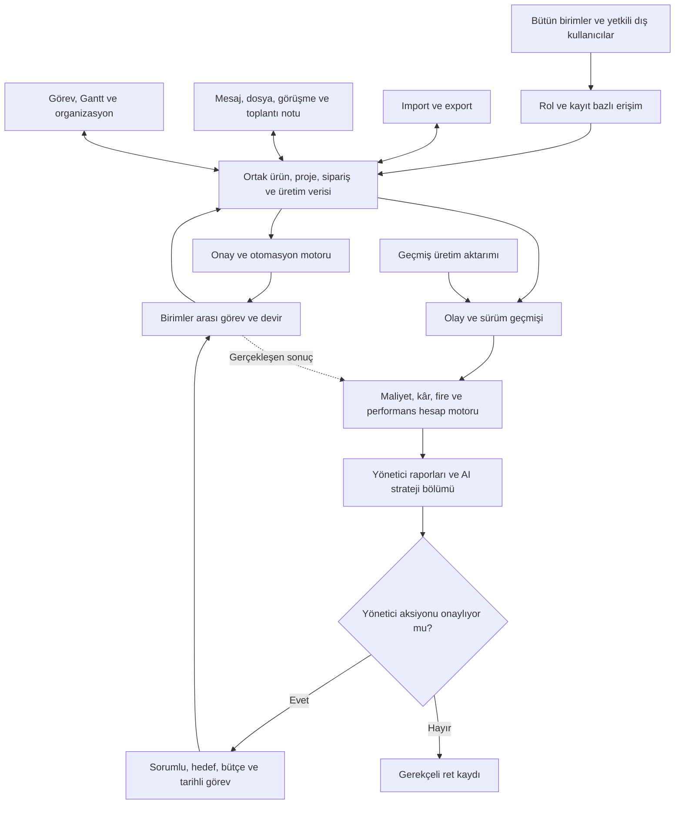

# APISFACTORY — ELEKTRONİK ÜRETİM PLATFORMU ANA GELİŞTİRME PROMPTU

Bu dosyanın tamamı geliştirme ajanına verilecek talimattır. Ek bir konuşma geçmişine ihtiyaç duymadan kullanılabilmelidir.

Ürünün adı **apisfactory**'dir; alan adı apisfactory.com'dur. Arayüzde, dokümanlarda, bildirim/e-posta şablonlarında ve yardım içeriğinde ürün adı her zaman küçük harfle “apisfactory” yazılır. Kod, paket, veri tabanı ve servis adlarında `apisfactory` öneki kullanılır. Ürün kategorisi “elektronik üretim platformu” olarak tanımlanır. Eski çalışma adı “Elektronik Üretim Platformu”nu ürün adı gibi kullanma; PartsPilot adını hiçbir yerde kullanma.

## 1. Görevin ve beklenen sonuç

Kıdemli ürün mimarı ve uygulama geliştiricisi olarak apisfactory'yi, elektronik ürün geliştiren ve üreten küçük/orta ölçekli şirketler için çok şirketli bir B2B SaaS olarak geliştir. Sistem; Ar-Ge, satış, satın alma, muhasebe, üretim, kalite ve depoyu ortak kayıtlar üzerinde birleştirsin. Mühendis, teknisyen, operatör, yönetici ve yetkilendirilmiş fason üretici aynı platformda kendi yetkileriyle çalışsın.

İlk fikir olan BOM izleme ve AI alternatif komponent asistanı, bütün ürün yaşam döngüsüne bağlı bir modül olarak yer alsın. Ürün; tasarımdan satın almaya, dizgiden kaliteye, sevkiyattan tahsilata ve geçmiş üretim analizine kadar uçtan uca işlesin.

Teslimin yalnızca tasarım, sunum, landing page veya sahte verili dashboard olmasın. Kalıcı veri tabanı, backend iş kuralları, çalışan arayüzler, yetkilendirme, kayıt geçmişi, entegrasyon adaptörleri, gerekli testler ve çalıştırma dokümantasyonu bulunan bir uygulama geliştir. Görsel prototipi ve gerçek çalışan özelliği ayrı belirt.

Bu prompt uygulamanın hedef kapsamını tanımlar. Gerçek şirket adına ödeme yapmak, tedarikçiye sipariş göndermek, müşteriye mesaj atmak, ücretli servis satın almak veya halka açık yayın yapmak için kendiliğinden yetki vermez. Geliştirme ve test ortamında ilerle; bu dış etkileri test bağlayıcılarıyla doğrula. Yetkilendirilmiş canlı uygulamada otomasyonlar şirket politikalarıyla çalışsın.

## 2. Çalışma yöntemi ve kapsam disiplini

1. Önce mevcut proje, dosyalar, yerel talimatlar, bağımlılıklar, veri tabanı ve testleri incele. Var olan çalışmayı gerekçesiz yeniden yazma; kullanıcı değişikliklerini koru.
2. Bu belgedeki R01–R48 gereksinimlerini izlenebilir bir kapsam tablosuna, W01–W42 iş paketlerini geliştirme listesine, T01–T24 senaryolarını kabul planına dönüştür.
3. Her gereksinim için durum, ilgili ekran/API, veri modeli, iş kuralı, test, kanıt ve engel alanları tut. Durumları en az planlandı, geliştiriliyor, doğrulandı, entegrasyon bekliyor ve tamamlandı olarak ayır.
4. Önce mimariyi ve bağımlılıkları kısaca açıkla, sonra ilk uygulanabilir fazı gerçekten geliştir. Sadece yapılacaklar listesi verip durma.
5. Her fazı çalışan bir dikey iş akışıyla tamamla. Bir düğmenin görünmesini işin bittiğine kanıt sayma. Sunucu kuralı, veri kaydı, yetki, hata durumu ve doğrulaması da tamamlanmalı.
6. Aynı oturumda bütün kapsam yetişmezse gerçekte yapılanları ve kalanları kaydet. Sonraki oturumda bu kayıtları okuyup devam et; tamamlanmamış modülü bitmiş gibi sunma.
7. Rutin ve geri alınabilir teknik seçimlerde makul varsayımla ilerle. Marka, canlı hesap, ticari sözleşme, şirket maliyet politikası ve gerçek dış işlem gibi kararları açık karar listesinde tut. Bir eksik API anahtarı yüzünden bağımsız işleri durdurma.
8. Hiçbir kabul edilmiş özelliği “MVP” gerekçesiyle sessizce silme. Fazlara bölmek teslim sırasıdır; kapsam değişikliği ayrı ve görünür karardır.
9. Bağlayıcı yoksa ekranı çalışıyormuş gibi gösterme. Demo, test, bağlanmadı, eski veri, hata ve canlı durumlarını açık ayır.
10. Gereksiz test yığını yerine kritik iş kuralları, veri bütünlüğü, yetki ayrımı ve entegrasyon hata yollarını doğrulayan anlamlı testler yaz.

## 3. Ürün konumlandırması ve kullanım ilkeleri

Temel ürün değeri: Şirketin gerçek projelerini, stoklarını, satın almalarını, teknik revizyonlarını ve üretim sonuçlarını birbirine bağlayarak tedarik ve üretim sorunlarını erken görünür kılmak; teknik alternatifleri kanıtla incelemek; onaylı eylemleri ilgili ekibe aktarmak.

“Rakiplerde yok”, “AI kesin eşdeğer bulur”, “üretim gecikmesini tamamen önler” gibi doğrulanmamış vaatler kullanma. Ürün değerini pilotta; eksik malzemeyi fark etme süresi, işlem tekrarı, revizyon hatası, veri girişi yükü ve ilk üretim emrine ulaşma süresiyle ölç.

### 3.1 apisfactory.com tanıtım sitesi ile hizalama

apisfactory.com için Türkçe ve İngilizce, dört sayfalık (Ana Sayfa / Home, Modüller / Modules, Fiyatlar / Pricing, İletişim / Contact) bir tanıtım sitesi tasarımı hazırlanmıştır. Site ürünün yerine geçmez ve bu promptun teslimi sayılmaz. Uygulama geliştirilirken aşağıdakileri koru:

- Sitedeki modül adları uygulamadaki menü ve modül adlarıyla aynı olsun. Bir modül adı değişirse site metni de güncellenecek değişiklik olarak açık karar listesine yazılsın.
- Site metinleri de bu bölümdeki doğrulanmamış vaat yasağına uyar. Sitede “canlı”, “entegre” veya “otomatik” diye sunulan bir yetenek, uygulamada test modunda ya da engelliyse site metni “planlanan/bağlantı kapsamı lisansa bağlıdır” diliyle kalır.
- Sitedeki fiyat, paket sınırı, müşteri logosu, iletişim bilgisi, kurulum süresi ve veri merkezi konumu yer tutucudur (`[FİYAT]`, `[X]`, `[SÜRE]` vb.). Bunlar pilot, hizmet maliyeti ve sağlayıcı teklifleriyle belirlenmeden doldurulmaz.
- Sitedeki demo formu gerçek müşteri verisi toplar. KVKK aydınlatma metni, açık rıza ve saklama süresi karar listesinde tutulur; form verisi ürünün müşteri kayıtlarına otomatik aktarılmaz.

Site ↔ uygulama modül eşlemesi:

| Sitedeki modül | Kapsadığı gereksinimler | İlgili paketler |
|---|---|---|
| Ar-Ge & BOM | Proje, bütçe, BOM sürümü, CAD import, sürüm farkı, üretime devir | R03, R05, R06, R36 · W11–W13 |
| Tedarik Riski | Distribütör verisi, stok/fiyat/termin, EOL/PCN, veri güncelliği | R10, R11, R37, R45 · W17 |
| AI Alternatif Komponent | Kanıt tablosu, pin/kılıf/elektriksel karşılaştırma, kapsamlı onay | R12–R14 · W29 |
| Satış & Termin | Teklif/kesin sipariş, devir engeli, rezervasyon, net ihtiyaç, termin | R06, R08, R09 · W14, W16 |
| Satın Alma | Talep, teklif karşılaştırma, sipariş, teyit, gecikme takibi | R03, R04, R15 · W18 |
| Depo & Lot | Mal kabul, karantina, lot/seri/makara, MSL, fason konumu | R16, R23, R43 · W15, W19, W33 |
| Üretim & Teknisyen | İş emri, rota, sürüm sabitleme, barkodlu teknisyen ekranı, tüketim | R07, R17, R38 · W20 |
| Kalite & Test | Kontrol planı, test istasyonu, uygunsuzluk, yeniden işleme, ekipman | R16–R18, R41 · W21, W22 |
| Platformun geri kalanı | Fason portalı, maliyet ve kâr, yönetici raporu ve AI strateji, mesaj/toplantı/Gantt, import/export, izlenebilirlik | R19–R35, R40, R42, R44, R46–R48 |

Görsel dil: Uygulama arayüzü tanıtım sitesiyle aynı marka temelini kullanır. Koyu zeminler #12130F / #1B1C17, açık zemin #F3F1EA, vurgu rengi bal sarısı #F5B301 ve petek (altıgen) logo işaretidir. Başlıklarda Archivo, gövde metninde IBM Plex Sans, kod/MPN/seri gibi teknik değerlerde IBM Plex Mono kullanılır. Renkler tasarım token'ı olarak tanımlanır. Durumlar yalnızca renkle değil, metin ve simgeyle de anlatılır. Uzun süreli masaüstü kullanım için açık tema da desteklenir.

Arayüz Türkçe başlasın ve İngilizce yerelleştirmeye hazır olsun. Masaüstü planlama ve analiz; tablet/mobil kullanım mal kabul, barkod, operasyon ve test için optimize edilsin. Teknisyene mühendislik ve finans ekranlarını yığma. Kullanıcının günlük iş listesi rolüne göre açılsın.

## 4. Kesin iş kuralları

- Ar-Ge, üretim ve kalite devir onayları tamamlanmadan ürün kesin satışa açılamaz. Geliştirme aşamasında teklif taslağı hazırlanabilir.
- Kesin siparişten önce uygun bitmiş stok, malzeme tedariki ve kapasite değerlendirilir. Tahmini termin ile müşteriye taahhüt edilen tarih farklı alanlardır.
- Sipariş onayında stok rezervasyonu, eksik ürün için üretim emri ve net malzeme için satın alma talebi oluşturulur. Tedarikçiye sipariş gönderimi ayrıca bütçe, tedarikçi ve yetki kurallarına bağlıdır.
- Fiziksel stok, kullanılabilir stok, rezerve miktar, açık alım, karantina ve fason konumundaki stok farklıdır. Aynı miktar iki işe ayrılamaz.
- Mal kabulü yapılmış ancak giriş kalitesi onaylanmamış parça üretimde kullanılamaz. Son kalite onaysız ürün sevk edilebilir bitmiş stok sayılamaz.
- Her üretim emri yayımlanmış BOM, PCB, firmware, test reçetesi, operasyon rotası ve dosya sürümlerini sabitler. Yeni revizyon geçmiş üretimi değiştiremez.
- AI önerisi teknik onay değildir. Yeni alternatif ancak yetkili teknik inceleme ve gerekli testlerden sonra, tanımlı ürün/revizyon/parti kapsamında kullanılabilir.
- Sohbet mesajı, toplantı cümlesi, Excel yükleme veya yönetici raporu resmî teknik/finansal onayın yerine geçmez.
- Stok hareketi, ödeme ve sipariş tekrar eden olaylarda çoğalmaz. Sonucu belirsiz dış işlem tekrar gönderilmeden önce sorgulanır.
- Log, test başarısızlığı, gerçekleşmiş stok hareketi ve tarihsel maliyet geriye dönük sessizce silinmez. Düzeltme yeni kayıtla yapılır.
- Geçmiş veri aktarımı canlı sipariş, ödeme, müşteri bildirimi veya yeni üretim başlatmaz.
- Maliyet, fire ve kârı deterministik hesap motoru hesaplar. AI bu sonuçları kaynaklarıyla yorumlar.
- Bütün yönetici raporlarında AI strateji bölümü bulunur. AI servisi yoksa “bekliyor/üretilemedi” durumu görünür; içerik uydurulmaz.

## 5. Organizasyon, kullanıcılar ve yetkiler

Şirket, tesis, departman, ekip, yönetici ve raporlama ilişkilerini modelle. Varsayılan departmanlar: satış, muhasebe, satın alma, üretim, Ar-Ge, kalite ve depo. Şirket bunları genişletebilsin. Kullanıcı birden fazla ekip veya rolde bulunabilsin.

Rolleri en az şu şekilde destekle:

| Rol | Temel işler | Sınır |
|---|---|---|
| Ar-Ge | Proje, BOM, prototip, devir, revizyon, alternatif incelemesi | Yetkili ürün/proje kapsamı |
| Satın alma | Talep, teklif karşılaştırma, sipariş, takip | Onaylı bütçe ve teknik seçim |
| Muhasebe | Fatura eşleştirme, ödeme, tahsilat, maliyet | Teknik revizyon yayımlayamaz |
| Üretim sorumlusu | Plan, iş emri, rota, kapasite, revizyon talebi | Yayımlanmış üretim tanımı |
| Teknisyen/operatör | Atanmış operasyon, kontrol, ölçüm, sorun bildirimi | Ticari/mali alanlar varsayılan kapalı |
| Kalite | Giriş/ara/son kontrol, uygunsuzluk, serbest bırakma | Tanımlı kalite karar yetkileri |
| Depo | Mal kabul, transfer, toplama, sayım, sevkiyat | Kalite kararını tek başına atlayamaz |
| Satış | Müşteri, teklif, sipariş, adres, termin onayı | Satışa açık ürün ve iskonto limitleri |
| Yönetici | Bütçe, istisna, politika, ekip ve strateji raporu | Yetkilendirildiği organizasyon kapsamı |
| Fason/dış kullanıcı | Kendisine atanmış iş, dosya teyidi, ilerleme | Diğer müşteriler ve iç ticari veriler kapalı |

Görüntüleme, oluşturma, düzenleme, yayımlama, onay, iptal, import, export, indirme ve dış paylaşımı ayrı izinler yap. Proje/tesis/departman/nesne kapsamı ve maliyet, satış fiyatı, banka bilgisi gibi alan izinleri uygula. Organizasyon şemasını erişim yetkisinin tek kaynağı yapma.

Vekâlet süreli ve kapsamlı olsun. Kendi talebini onaylama politikası, parasal limit, kur tarihi ve üst onay kuralı tanımlanabilsin. Teknik sistem yöneticisi otomatik olarak bütün iş kararlarını onaylayamasın. Yetki değişikliklerini logla; sunucu, arama, export, dosya bağlantısı ve AI erişiminde aynı kontrolleri uygula.

## 6. Ortak veri modeli

Her iş nesnesinde değişmeyen kimlik, şirket kimliği, insanın okuyacağı kod, durum, sahip, oluşturma/güncelleme zamanı ve gerekli sürüm bilgisi olsun. Üretici MPN'sini şirket içi stok kodundan ve distribütör satış kodundan ayır.

Asgari veri grupları:

- Organizasyon: şirket, tesis, departman, ekip, üyelik, rol, izin, vekâlet, iş takvimi.
- Ürün: ürün ailesi, ürün, varyant, PCB revizyonu, BOM sürümü/satırı, referans tasarımcıları, DNP işareti, firmware, test reçetesi, yayımlanmış üretim paketi.
- Komponent: üretici, tam MPN, iç kod, teknik parametreler ve birimler, kılıf, pin bilgisi, datasheet sürümü, yaşam döngüsü olayı, alternatif aday, teknik onay.
- Proje: gereksinim, bütçe, görev, kilometre taşı, zaman kaydı, prototip, deney, gider ve devir paketi.
- Ticari: müşteri, adres, teklif, satış siparişi/satırı, teslim taahhüdü, rezervasyon, sevkiyat ve iade.
- Tedarik: talep, teklif, tedarikçi, satın alma siparişi/satırı, teslim programı, teyit, mal kabul, uyuşmazlık ve fatura bağlantısı.
- Stok: depo, konum, lot, seri, makara, sahiplik, durum, koşul, rezervasyon ve hareket defteri.
- Üretim: iş merkezi, kapasite, vardiya, rota, operasyon, iş emri, gerçek malzeme tüketimi, duruş ve çıktı.
- Kalite: kontrol planı, test çalışması, ölçüm, limit sürümü, cihaz/aparat, kalibrasyon, uygunsuzluk, yeniden işleme ve serbest bırakma.
- Finans: maliyet olayı, gider dağıtımı, tedarikçi/müşteri fatura bağlantısı, ödeme/tahsilat kaydı, vade ve düzeltme.
- İşbirliği: konuşma, mesaj, dosya/sürüm, toplantı, kayıt, transkript, not, karar, görev ve bildirim.
- Analiz: metrik tanımı/sürümü, rapor anlık görüntüsü, AI çalışma kaydı, kaynak, öneri, senaryo ve etki ölçümü.
- İşletim: entegrasyon hesabı, senkronizasyon işi, dış işlem kaydı, abonelik, kullanım kotası, olay günlüğü ve yedek kayıtları.

Bir satış satırı birden çok üretim ve sevkiyatla karşılanabilsin. Ortak satın alma birden çok projeye paylaştırılsın; paylar miktarı aşmasın. Lot tüketimleri ve iadeleri ayrı hareket olsun. Alt montajın kendi lot ve üretim geçmişi üst ürüne bağlansın.

Para ve miktarlarda sabit hassasiyetli sayılar kullan. Para birimi, kur kaynağı/tarihi, miktar birimi ve dönüşümleri açık tut. Zamanları saat dilimiyle işle. Silme yerine arşivleme veya ters kayıt gereken alanları tanımla. Referans bütünlüğünü yalnızca arayüze bırakma.

## 7. Akış ve otomasyon motoru

Olay → koşul → yetki/onay → eylem → sonuç → kayıt biçiminde bir motor geliştir. Hazır şirket şablonları ve yetkili yöneticiye kural düzenleme ekranı sağla. Değişiklik yayımlanmadan önce örnek veri üzerinde kuru çalıştırma yapılabilsin.

Durum makineleri en az şunları kapsasın:

| Süreç | Ana durumlar | İstisnalar |
|---|---|---|
| Ürün | Taslak, geliştirme, pilot, devir incelemesi, yayımlandı | Ret, askıya alma, yeni revizyon, kullanım sonu |
| Satış | Taslak, uygunluk incelemesi, termin onayı, kesinleşti | Değişiklik, kısmi teslim, iptal |
| Alım | Talep, inceleme, onay, gönderildi, teyit, teslim | Ret, gecikme, kısmi teslim, iade |
| Malzeme | Beklenen, alındı, kontrolde, kullanılabilir | Karantina, ret, süresi doldu, bloke |
| Üretim | Planlandı, malzeme bekliyor, hazır, işlemde, son test | Bekletme, yeniden işleme, hurda, iptal |
| Sevkiyat | Paketleme, kontrol, depoda, ayrıldı, sevk edildi | Hasar, kısmi sevk, teslim sorunu, iade |
| Ödeme | Planlandı, onay bekliyor, işleme alındı, ödendi | Ret, hata, kısmi ödeme, ihtilaf |
| AI önerisi | Önerildi, inceleniyor, kabul/ret, uygulanıyor, ölçülüyor, kapandı | Eksik kanıt, süresi geçmiş veri |

Her geçişin sunucu tarafında ön koşulu, yetkisi ve değişmeyen olay kaydı olsun. Zaman aşımı, vekil atama, üst sorumluya bildirim, manuel müdahale ve tekrar deneme kuralları ekle. Çalışan iş varsayılan olarak başladığı akış sürümünde kalsın; taşıma açık karar olsun.

Sipariş, rezervasyon, stok hareketi, belge ve ödeme işlemlerine tekrar koruması uygula. Veri tabanı değişikliği ile arka plan olayının kopmaması için işlem çıkış kutusu gibi güvenilir bir yöntem kullan. Bildirim hatası başarılı stok hareketini geri almamalı. Dış işlemin sonucu bilinmiyorsa “başarılı” veya “başarısız” diye uydurma; sorgulama/uzlaştırma durumu aç.

## 8. Ar-Ge, BOM, prototip ve üretime devir

Proje açılırken hedef ürün, gereksinimler, sorumlular, bütçe, tarih, başarı ölçütü ve görevler kaydedilsin. Elektronik, mekanik, firmware, test, dış hizmet ve kablo gibi işler aynı projeye bağlansın. Prototip, pilot ve seri üretim ayrı tipler olsun.

Ar-Ge malzeme talebinde proje, MPN veya tanımlı genel ihtiyaç, miktar, gerekçe, ihtiyaç tarihi ve maliyet merkezi bulunsun. Önce mevcut stoktan karşılama değerlendirilsin, kalan satın almaya aktarılsın. Muhasebe her giderin hangi projeye ait olduğunu görebilsin. Ortak alım ve giderler paylaştırılsın.

BOM için Excel/CSV yükleme, Altium/KiCad dışa aktarım dosyalarını kolon eşleştirmeyle alma ve sonradan yerel CAD bağlantısı ekleme altyapısı kur. Üretici, tam sipariş MPN'si, miktar, referans kodları, varyant, dizilmeyecek parça, onaylı alternatif ve teknik belge bağlantıları tut. Belirsiz parça eşleşmesini otomatik kesinleştirme. BOM karşılaştırmasında eklenen, silinen, miktarı/MPN'si değişen satırları göster.

Üretime devir paketi şunları içersin: PCB/BOM sürümü, üretim dosyaları, montaj talimatı, firmware dosyası ve yükleme yöntemi, test prosedürü/limitleri, onaylı alternatifler, operasyon rotası, aparat/cihaz ihtiyacı, pilot sonuçları ve açık sorunlar. Dosya sürümü ve doğrulama özeti saklansın.

Ar-Ge teknik içeriği; üretim uygulanabilirliği; kalite kontrol ve kabul hazırlığını onaylasın. Eksik belge veya açık kritik sorun varken devir kapanmasın. Ret halinde sorumlu ve son tarihli düzeltme işi açılsın. Onaydan sonra üretim paketi yayımlansın ve ürün kesin satışa açılsın.

Devirde Ar-Ge maliyeti raporlansın: prototip malzemesi, PCB/dizgi, mühendislik zamanı, dış hizmet, test ve diğer tanımlı giderler. Gelmemiş faturalar varsa rapor geçici olsun; yeni giderler tarihçeli düzeltmeyle işlensin. Ar-Ge payının ürün maliyetine aktarımında aynı gideri iki kez sayma.

## 9. Revizyon ve mühendislik değişikliği

Üretim, kalite, Ar-Ge ve satış sonrası ekip değişiklik talebi açabilsin. Talep; ürün/PCB/BOM sürümü, ilgili referans, seri/lot/iş emri, sorun, kanıt dosyası, aciliyet ve üretimi durdurma ihtiyacını içersin. Talep açılması BOM'u doğrudan değiştirmesin.

Ar-Ge teknik çözümü; üretim süre ve aparat etkisini; satın alma eldeki stok/açık alım etkisini; kalite test kapsamını; muhasebe maliyet etkisini incelesin. Geçici parti sapması, kalıcı revizyon, üretim durdurma ve saha aksiyonu ayrı kararlar olsun.

Onaylanan değişiklik için geçerlilik başlangıcı tarih, parti veya seri aralığıyla belirlensin. Açık işler için eski sürümle devam, kontrollü geçiş, yeniden işleme veya iptal kararı verilsin. Eski malzemeye tüket/iade/bloke/değerlendir kararı kaydedilsin. Revizyon fark raporu ve dosya teyidi üret.

Üretim ekranı yalnızca ilgili işin yayımlanmış dosyasını sunsun. Fason üretici yeni paketi aldığını teyit etsin. İndirilen eski dosyanın uzaktan silindiğini varsayma. Yanlış yayımlama düzeltildiğinde geçmiş silinmesin, yeni düzeltme sürümü oluşsun.

## 10. BOM izleme ve tedarik risk asistanı

DigiKey, Mouser, Farnell ve Octopart/Nexar için sağlayıcıdan bağımsız adaptörler tasarla. Gerçek desteklenen alanları ve erişim koşullarını uygulama aşamasında resmî dokümantasyonla doğrula. Ürün arama API'sini sipariş durumu veya sipariş verme API'siyle karıştırma.

İzin verilen kaynaklardan MPN, stok, fiyat kademesi, MOQ, sipariş katı, ambalaj, para birimi, teslim süresi, yaşam döngüsü ve değişiklik bilgilerini al. EOL/PCN için üretici duyurusu veya lisanslı ek veri gerekebileceğini modelle; bütün API'lerin bunu eksiksiz verdiğini varsayma.

Her kayıtta kaynak, sorgu zamanı, bölge, ambalaj, teklif geçerliliği ve veri durumu tut. Aynı kaynağın farklı platformlarda görünen stoğunu körlemesine toplama. Boş, sıfır, bilinmiyor ve eski veriyi ayır. Özel müşteri fiyatını başka şirkete gösterme.

Lisans izin veriyorsa tarihsel anlık görüntülerle stok düşüşü, fiyat artışı ve termin uzamasını izle. Yeterli tarihçe yoksa değişim yüzdesi üretme. EOL/PCN olayını etkilenen tam sipariş kodu, yürürlük tarihi, BOM ve açık üretimlerle eşleştir.

Risk kartı şu sorulara yanıt versin: Ne değişti? Hangi kaynaktan? Veri ne kadar yeni? Hangi proje/sipariş/üretimler etkileniyor? İhtiyaç tarihine kadar kaç adet açık var? Onaylı alternatif var mı? Önerilen aksiyon, sorumlu ve son tarih ne?

Risk eşiği ve izleme sıklığı şirketçe ayarlanabilsin. Uyarıları tekilleştir; çözülmüş riski kapat; kritik gecikmeyi ilgili birime yükselt. “Altı aylık stok için al” önerisini tüketim tahmini, açık sipariş, bütçe ve stok politikası olmadan kesin miktarla üretme.

## 11. “AI'ya sor” ile alternatif komponent

Riskli veya stoğu yetersiz BOM satırına “AI'ya sor / Alternatif bul” eylemi ekle. Ar-Ge ve yetkili üretim kullanıcıları çağırabilsin. Önce ilgili ürün/revizyon için onaylı alternatifleri ara; sonra izinli kaynak ve üretici belgelerinden yeni aday araştır.

Girdiler: üretici ve tam MPN, datasheet sürümü, kılıf, pin tablosu, kritik elektriksel sınırlar, sıcaklık, uygulamadaki işlev, hedef adet/tarih ve varsa şema/netlist, firmware/çevre birimi/bellek gereksinimleri. Eksik girdileri açık göster.

Sonuç tablosunda her aday için:

- Tam kod, üretici, kategori ve kaynak bağlantıları.
- Kılıf ölçüleri, pad/footprint, pin sayısı ve mekanik farklar.
- Pin numarası ve işlevi bazında eşleşme; farklı ve belirsiz pinler.
- Besleme, akım, gerilim, hız, güç, tolerans, sıcaklık ve kategoriye özgü sınırlar.
- Firmware/register/protokol/bellek/periferik farkları ve gereken doğrulama.
- Stok, sorgu zamanı, fiyat kademesi, MOQ ve termin.
- Her alan için uyumlu, uyumsuz veya kanıt yetersiz durumu.
- Kaynak belge/sayfa/alan, test ihtiyacı, tasarım değişikliği ve onay kapsamı.

AI metin ve tabloları çıkarsın; kritik eşleştirmeler sürümlü kategori kurallarıyla kontrol edilsin. Pasifler, regülatörler, MOSFET'ler, konnektörler ve MCU'lar aynı eşdeğerlik kuralıyla değerlendirilmesin. MCU'da yalnızca pin/package benzerliğiyle “firmware değişmez” sonucu verme. Şema yoksa uygulamaya özel uygunluk kesinleştirilemez; firmware kanıtı yoksa yazılım etkisi belirsiz kalır.

Aday bulunamazsa bunu söyle. Tek başına güven yüzdesini teknik kanıt yerine kullanma. Desteklenmeyen parça ailesini “araştırma adayı” olarak işaretle. Başlangıçta doğrulanmış kategori kapsamını açıkça tanımla; diğer kategoriler için eksiklik görünür olsun.

Varsayılan yeni alternatif onayı Ar-Ge'de olsun. Yönetici uygun teknik yetkinlikteki üretim sorumlusuna bu yetkiyi verebilsin. Onay; ürün, revizyon, parti, süre ve koşula bağlı olsun. Gereken durumda pilot kullanım → test → seri kullanım sırasını uygula. Rev.B için onay Rev.C'ye otomatik taşınmasın.

Onaydan sonra satın alma ve iş emri gerçek malzeme listesine uygula. Dizgi, programlama veya montaj dosyası etkileniyorsa sürümlü güncelleme/doğrulama işi aç. Onaysız adayla malzeme çıkışı veya dizgi yapılamasın. Kullanılan alternatif ve gerçek lot cihaz geçmişinde görülsün. Model, prompt, kaynak sürümü ve insan kararı loglansın.

## 12. Satış, stoktan karşılama ve termin

Müşteri, teslim/fatura adresleri, ürün/varyant, miktar, fiyat, iskonto, hedef tarih, ödeme koşulu ve sevkiyat biçimi kaydedilsin. Teklif taslağı ile kesin sipariş ayrı olsun. Devir onaysız üründe kesin sipariş sunucuda engellensin.

Önce kalitece serbest bırakılmış, doğru revizyondaki ve müşteriye uygun bitmiş stok değerlendirilsin. Yeterli kısım rezerve edilsin, kalan için üretim ihtiyacı açılsın. Geçici teklif rezervasyonu kullanılıyorsa süresi ve serbest bırakılma kuralı olsun.

Net malzeme ihtiyacını; üretim gereksinimi ve tanımlı emniyet payından, kullanılabilir ayrılmamış stok ve ihtiyaç tarihine yetişen teyitli/ayrılmamış alımları düşerek hesapla. Karantina, hurda, son kullanım tarihi, sahiplik ve başka işe ayrılmış miktarı uygun stok sayma.

Termin hesabı malzeme dışında iş merkezi kapasitesi, vardiya, tatil, hazırlık/değişim süresi, operasyon bağımlılığı, fason iş, test, yeniden test payı, paketleme ve lojistiği içersin. Tedarikçi teyidi ve güncellik gösterilsin. Bilgi yetersizse kesin gün yerine aralık veya hesaplanamadı durumu kullan.

Satış/müşteri onayı ve gerekli ticari yetkiler tamamlanınca kesin sipariş, rezervasyon, üretim emri ve alım talepleri oluşsun. Alım siparişini dışarı gönderme ayrıca satın alma onaylarından geçsin. Kısmi teslim ve alternatif tarih desteklensin.

Sipariş değişikliği/iptalinde açık alım, devam eden üretim, ayrılmış stok ve ek maliyet gösterilsin. Fiziksel hareketler silinmesin; rezervasyon kaldırma, tedarikçi iptal talebi ve üretilmiş malı stoğa alma ayrı yürüsün. Gecikme müşteriye verilmiş tarihi sessizce değiştirmesin.

## 13. Satın alma ve tedarikçi takip

Ar-Ge/üretim talebi proje, ürün, iş emri, miktar, ihtiyaç tarihi ve maliyet merkeziyle gelsin. Ortak MPN ihtiyaçları birleştirilebilsin, ancak proje ve miktar tahsisleri korunsun.

Distribütör ve yerel tedarikçi tekliflerini; tam MPN, üretici, ambalaj, MOQ, sipariş katı, fiyat kademesi, para birimi, nakliye, teslim koşulu ve geçerlilik bakımından karşılaştır. Yetkili distribütör tercihi ve onaylı tedarikçi politikası uygula. Görünen stok rezervasyon garantisi değildir.

Sipariş gönderimi için teknik seçim, bütçe, tutar/fiyat sapma limitleri ve tedarikçi onayı doğrulansın. Gönderilmiş belge sabitlensin; değişiklik yeni sürüm ve karşı taraf teyidiyle yapılsın. Muhasebeye proje tahsisi, tutar, avans/peşin/vade şartları ve belgeler aktarılsın. Satın alma siparişi ödeme emri yerine geçmesin.

Sipariş satırları kısmi ve farklı tarihli teslim edilebilsin. Teyit, beklenen tarih, gönderim ve takip numarası ayrı tutulsun. Uygun API varsa otomatik sorgu; yoksa portal, yetkilendirilmiş e-posta veya manuel teyit yolu olsun.

Hatırlatma alıcıları, şablonu, sıklık limiti, son yanıt ve yükseltme kuralı şirketçe tanımlansın. Gecikmenin etkilenen üretimlere etkisi gösterilsin. Tekrarlı bildirimleri önle; takip “gecikme olmayacağı garantisi” diye sunulmasın.

Teslimde sipariş, mal kabul, giriş kalite ve fatura eşleştirilsin. Eksik/fazla/yanlış/hasarlı mal için uyuşmazlık, iade, değişim ve alacak belgesi bağlantısı tut. Teslim, iptal ve açık miktarlar uzlaşmadan sipariş kapanmasın.

## 14. Depo, stok, lot ve fiziksel koşullar

Tesis, depo, raf/konum, hazırlık, üretim ve fason konumlarını destekle. Şirket ve müşteri sahipliğini ayır. Stok adedini doğrudan düzenletme; giriş, çıkış, transfer, tüketim, iade, sayım düzeltmesi ve hurda hareketleriyle yönet.

Mal kabulde barkod veya elle MPN, adet, lot/seri, ambalaj, tarih, belge ve fotoğraf al. Kısmi teslimi destekle. Mal kontrol bekleyen alana girsin; atanmış teknisyen kontrolü ve yetkili kalite kararı sonrası kullanılabilir olsun. Reddi karantinaya/iade sürecine bağla.

Fiziksel, kullanılabilir, rezerve, karantina, beklenen ve dışarıdaki miktarları ayrı göster. Eş zamanlı rezervasyon/tüketimde negatif veya çift tahsis oluşmasın. Sayım farkı gerekçe ve onaylı düzeltme hareketi yaratsın.

Makara, kesilmiş bant, açık paket ve lot bölme ilişkisini koru. Kullanılmayan üretim malzemesi doğru lot/koşulla iade edilsin. Fason transferi iç fiziksel stoğu düşürsün; sahipliği gerekiyorsa şirkette kalsın.

İlgili malzemelerde MSL, paket açılış zamanı, kullanım ortamı/süresi, raf ömrü ve saklama şartları bulunsun. Lehim pastası/yapıştırıcı gibi sarfların son kullanımını izle. Kurutma ve yeniden uygunluk üretici bilgisi ve şirket prosedürüne bağlı olsun. AI süre uydurmasın. FIFO/FEFO gibi çıkış politikasını kategoriye göre uygula; gereksiz alanları bütün parçalara zorunlu yapma.

## 15. Üretim ve teknisyen ekranı

İş emri yayımlanmış ürün sürümü, miktar, termin, sorumlu, satış bağlantısı ve rota taşısın. Rota; malzeme hazırlama, dizgi, lehimleme, kontrol, programlama, fonksiyon testi ve mekanik montaj gibi düzenlenebilir adımlardan oluşsun. Zorunlu kalite kapıları atlanamasın.

Teknisyen barkodla işi/cihazı açsın; doğru talimat, fotoğraf, malzeme, kontrol listesi ve firmware bilgisi gelsin. Başla, duraklat, sorun bildir ve tamamla eylemleri olsun. İşleme süresi, bekleme ve duruşu ayır; duruş nedenlerini malzeme, ekipman, kalite, personel veya dış bağımlılıkla kaydet.

Gerçek tüketilen MPN ve lotları kaydet. Yanlış parça/lot ve firmware sürümünü yakala. Firmware dosyasının doğrulama özeti mümkünse cihaz/programlama kaydıyla eşleşsin. Fotoğraf/video sorunları otomatik iş emri, operasyon ve seriyle bağlansın.

Kısmi operasyon ve kısmi miktar kapanışı desteklensin. Sağlam, hurda, yeniden işleme ve devam eden cihazları çifte saymadan uzlaştır. Aynı cihazın aynı operasyonu yanlışlıkla iki kez bitirmesini engelle. Yetkili yeniden işleme ayrı döngü olsun.

Teknik sorunda işi bekletme ve Ar-Ge revizyon talebi açma mümkün olsun. Onaylı alternatif yalnızca ilgili kapsamda seçilsin. Eksik zorunlu ölçüm, operasyon veya malzeme uzlaşması varken tam kapanış verilmesin. Kaliteye devredilen adet üretim çıkışıyla tutsun. Paketleme son kalite onayından sonra ayrı operasyon olsun.

## 16. Kalite, test istasyonu ve ekipman

Giriş, ara, son ürün ve paketleme kontrol planları oluştur. Planlar ürün/revizyon, tedarikçi veya parça sınıfına bağlanabilsin. Ölçüm adı, birim, alt/üst sınır, yöntem, numune planı, zorunlu kanıt ve reçete sürümünü tut.

Test istasyonu API, kontrollü CSV veya saha servisiyle sonuç verebilsin. İstasyon kimliği, yazılım sürümü, aparat, ölçüm cihazı, operatör, seri, zaman, ham sonuç ve limit sürümü kayıtlı olsun. Cihaz destekliyorsa sadece geçti/kaldı değil ölçüm değerlerini de al. Tekil test çalışma kimliğiyle tekrarları ayıkla.

Bağlantı kesilirse istasyonda kuyruk ve kontrollü senkronizasyon olsun. Eksik veri veya bağlantı hatası geçer sonuç sayılmasın. Ekipman bakım/kalibrasyon tarihi, belge ve kullanım kapsamını tut; süresi dolduğunda politikaya göre uyar/engelle. Sonradan sorunlu bulunan cihazdan etkilenen testleri bul.

Başarısız kontrol uygunsuzluk açsın. Hata kodu, etkilenen adet, kanıt, sorumlu ve olası kapsam kaydedilsin. Yeniden işleme, tamir, iade, hurda veya yetkili istisna ayrı kararlardır. Gerekçesiz serbest bırakma olmasın. Tamir sonrası gereken testler açık olsun; tekrarlayan hata düzeltici faaliyet ve etkinlik kontrolü açsın.

İlk başarısız test silinmesin. Retest ilk test başarı oranını artırmasın. Numune kontrolü tüm cihazlar test edilmiş gibi sunulmasın. Limit değişikliği eski sonucun orijinal kararını değiştirmesin; yeniden değerlendirme ayrı sürüm olsun. Operatör kendi test limitini değiştiremesin.

## 17. Paketleme, sevkiyat, muhasebe ve tahsilat

Kalitece serbest bırakılan ürün paketleme işine dönsün. Kutu, aksesuar, ürün/seri etiketi ve paket kontrolü tamamlansın. Depoya bitmiş stok girişi yapılsın; hazır bitmiş stoktan satış yolu da aynı sevkiyat kontrollerini kullansın.

Satış siparişinden doğru müşteri, teslim adresi, miktar, seri/lot, sevkiyat şekli ve fatura bilgisi gelsin. Toplama ve adres kontrolünden sonra kargo etiketi, irsaliye/e-irsaliye ve fatura/e-fatura uygun sağlayıcı üzerinden üretilebilsin. Yerel taslak PDF ile resmî düzenlenmiş belgeyi ayrı göster. Aynı gönderim veya belge isteği tekrar geldiğinde mükerrer belge oluşmasın. Takip numarası, kısmi sevk, teslim teyidi, hasar ve teslim sorunu izlenebilsin.

Muhasebe satın alma siparişi, mal kabul ve tedarikçi faturasını miktar/fiyat bakımından eşleştirsin. Avans, peşin, vade, kısmi ödeme, mahsup, iade ve açık bakiye desteklensin. Her gider proje/ürün/iş emriyle ilişkilendirilsin. Uyuşmazlık açık inceleme olmadan kapatılmasın.

Gerçek banka para transferi zorunlu ilk kapsam değildir; ödeme talebi, yetkili onayı, planı, gerçekleşme teyidi ve entegrasyon sınırı açık olsun. Dış mali sistemle hangi kaydın ana kaynak olduğu belirlensin. Ödeme/tahsilat durumu ile kârlılığı karıştırma.

Vadesi geçmiş açık bakiye için müşteriye veya muhasebeye tanımlı kuralla hatırlatma gönderilebilsin. Gönderimden hemen önce güncel bakiye ve ödeme durumu yeniden doğrulansın. Sıklık limiti, alıcı, şablon, son hatırlatma ve durdurma koşulu olsun. Ödenmiş faturaya gecikme bildirimi gitmesin.

İade/garanti/saha arızası müşteri, ürün seri numarası, revizyon, lot, firmware, test geçmişi ve satışa bağlansın. İade malı otomatik sağlam stoğa alma; inceleme, tamir, değişim, hurda, alacak belgesi ve yeniden sevk yollarını destekle.

## 18. Maliyet, kâr, fire ve performans motoru

Hesapları sürümlü, deterministik kurallarla üret. Her rakamın kaynak hareketlerini açılabilir yap. Tahmini teklif maliyeti, planlanan üretim maliyeti, gerçekleşen ve henüz tamamlanmamış maliyet farklı olsun. Eksik fatura/işçilik/gider varken raporun tamamlanma durumu görünsün.

Asgari formüller ve kurallar:

| Gösterge | Tanım |
|---|---|
| Ürün hurda oranı | Hurdaya ayrılan benzersiz cihaz / ilgili kapsamda üretime alınan cihaz |
| İlk testte başarı | İlk testinde geçen cihaz / ilk test uygulanmış benzersiz cihaz |
| Yeniden işleme oranı | Yeniden işleme giren benzersiz cihaz / tanımlı üretim kapsamı |
| Komponent firesi | Fire miktarı / şirketçe tanımlı tüketim veya üretime çıkış miktarı; payda raporda yazılır |
| Üretim maliyeti | Gerçek malzeme tüketimi + işçilik + dış hizmet + tanımlı üretim giderleri |
| Birim üretim maliyeti | İlgili partiye dağıtılan maliyet / kabul edilen sağlam adet |
| Brüt kâr | Net satış geliri − satılan ürünlere ait maliyet |
| Brüt marj | Brüt kâr / net satış geliri; gelir sıfırsa hesaplanamaz |
| Zamanında teslim | Tanımlı sipariş/satır bazında onaylı taahhüde göre zamanında teslim oranı |
| Bütçe sapması | Gerçekleşen veya güncel tahmin − onaylı baz bütçe |

Hurda yükü, malzeme değerleme yöntemi, işçilik saat ücreti, genel gider, Ar-Ge payı, nakliye, yeniden işleme ve kur/vergi etkisi muhasebe politikasıyla tanımlansın. Politika sürümü ve geçerlilik tarihi tutulsun. Sıfır sağlam adet varsa birim maliyeti sonsuz/uydurma sayı yapma; hesaplanamaz ve toplam kayıp göster.

Güncel distribütör fiyatını geçmiş tüketim maliyetinin üzerine yazma. Geç gelen faturayla yeni hesaplama sürümü oluştur; aynı gideri iki kez sayma. Satılmamış cihazda gerçekleşmiş satış kârı gösterme. Kısmi satış ve iadede doğru parti maliyetini izle. Nakit akışı ve tahsilatı kâr grafiğinden ayrı sun.

Ekip performansında haftalık, aylık, yıllık ve özel dönem raporları olsun. Prototip/pilot/seri üretimi, ürün karmaşıklığını, parti büyüklüğünü, veri eksikliğini ve dış bağımlılıkları dikkate al. Mesaj sayısını veya çevrim içi süreyi verimlilik puanı yapma. Tedarikçi gecikmesini teknisyenin hatası diye yazma. Rapor sayılarının tanımı ve karşılaştırma kapsamı görünür olsun.

## 19. Fason üretici portalı

PCB, dizgi, mekanik kutu, kablo, montaj ve dış test hizmetlerini kapsa. Dış firma yalnızca kendisine atanmış işleri ve açıkça paylaşılan alanları görsün. İç maliyet, başka müşteri, personel veya strateji raporları erişime kapalı olsun.

Dış işte kapsam, miktar, tarih, fiyat, tarafların sağlayacağı malzemeler, test şartları ve teknik paket sürümü tut. Kabul/karşı teklif, malzeme teslim teyidi, eksik/hasarlı miktar ve revizyon alındı teyidi olsun.

Gönderilen malzemeleri fason konumuna transfer et. Hazırlık, üretimde, testte, sevke hazır ilerlemesini; sağlam adet, fire ve kullanılmayan malzemeyi kaydet. Dış firmanın beyanını şirketin kesin kabulüyle karıştırma; miktar, maliyet ve iadeler uzlaştırılsın.

Fotoğraf, video, test raporu ve teslim belgesi yüklenebilsin. Revizyon gelince başlanmış iş için devam/durdur/yeniden işle kararı alınsın. Eski indirilmiş dosyanın kullanımı uzaktan garantiyle engellenemez; sürüm teyidi ve iş emri kontrolü uygula. Tedarikçi performansını teyitli termin, kalite, eksik belge ve yeniden işleme üzerinden raporla.

## 20. Görev, Gantt, organizasyon ve iletişim

Görevler ürün, proje, sipariş, iş emri, kalite olayı veya AI önerisine bağlansın. Sorumlu kişi/birim, öncelik, başlangıç/bitiş, süre, bağımlılık, kontrol listesi ve durum tut. Kullanıcı tüm rollerinden gelen görevleri ortak günlük listede görsün.

Gantt aynı görev/operasyon verisinden üretilsin. Bağımlılık, kilometre taşı, vardiya/tatil, kaynak kapasitesi, baz plan ve gerçekleşen tarih gösterilsin. Döngüsel bağımlılığı reddet. Sürükleyerek tarih değiştirme yetkiye tabi olsun; gecikme etkisini hesapla, müşteri taahhüdünü sessiz değiştirme.

Organizasyon şeması şirket/departman/ekip/yönetici ilişkilerinden çizilsin. Çoklu proje üyeliği, geçici görevlendirme ve tarihsel organizasyon yapısı desteklensin. Şemanın hiyerarşisi veri izinleriyle karıştırılmasın.

Mesajlaşma: birebir, grup, departman kanalı ve kayıt içi konuşma; kişi etiketleme, okunmamış mesaj, arama, bildirim tercihleri ve mesajdan görev açma. Dosya, fotoğraf ve video gönderimi; sürüm ve erişim kontrolü. İç ekip konuşması ile dış üreticiye açık konuşmayı ayır.

Toplantı: proje/görev içinden planlı veya anlık sesli/görüntülü görüşme, ekran paylaşımı, katılımcı yönetimi ve bağlantı durumu. Gerçek medya aktarımı için uygun sağlayıcı/adaptör kullan; yalnızca açılan bir modalı görüntülü görüşme sayma. Sağlayıcı bağlantısı yoksa test/durum açık olsun.

Kayıt isteğe bağlı olsun. Başlangıç bildirimi, şirketin onaylı katılım prosedürü, erişim/indirme izinleri ve saklama süresi uygulansın. Kayıt kapalıyken gizlice kayıt alma. Transkript ve AI toplantı özeti oluştur; konuşmacı veya ifade belirsizliğini işaretle. Karar, sorumlu ve tarih önerileri insan incelemesinden sonra göreve dönüşsün. Toplantı cümlesi otomatik ödeme/sipariş/BOM değişikliği başlatmasın.

## 21. Bütün birimlerde import/export

Ortak içe/dışa aktarım altyapısı geliştir. Tablosal veri için CSV/XLSX; raporlar için PDF/XLSX/CSV; sistemler arası aktarım için JSON/API; teknik dosya ve medya için sürümlü ek desteği sağla. Formatı uygun olmayan veriyi zorla dönüştürme. PDF/görselden çıkarılan veriyi inceleme gerektiren öneri olarak göster.

İçe aktarım sihirbazı: şablon indir → yükle → sayfa/başlık seç → kolon eşleştir → tip/birim/ilişki kontrolü → önizleme → yetkili onay → arka plan işi → sonuç/hata dosyası. Eşleştirme şablonları şirket/birim bazında saklansın.

Tarih, ondalık ayırıcı, para birimi, birim dönüşümü, zorunlu alan, MPN ve referans bütünlüğünü doğrula. Ekle/güncelle ayrımı, eşleştirme anahtarı ve boş hücre davranışı açık olsun. Mükerrer satır ve tekrar dosya kontrolü yap. Kısmi başarıyı satır bazında göster; büyük aktarım ekranı kilitlemesin.

Stok açılışı/düzeltmesi hareket oluştursun. Yayımlanmış BOM ve kapanmış üretim üzerine yazılamasın. İşlenmemiş hatalı aktarım geri alınabilsin; bağımlı hareket varsa ters/düzeltme kaydı kullan.

Geçmiş üretim aktarımında bilinmeyen lot, süre veya test sonucu uydurma. Tarihsel moda alınan olaylar dış gönderim, ödeme veya yeni üretim oluşturmasın. Açılış bakiyeleri ve miktarlar yetkili uzlaşmayla devreye girsin.

Export seçili satır, filtreli sonuç veya yetkili tam veri kümesi için çalışsın. Sütun, dönem, ürün, proje, revizyon ve durum seçilebilsin. Alan yetkileri dosyada da geçerli olsun. Raporun filtre, birim, para birimi, üretim zamanı, hesap sürümü ve tamamlanma bilgisi çıktıya girsin. CSV/Excel formül enjeksiyonunu önle.

Şirketin çıkış paketi kayıtları, kimlikleri, ilişkileri, dosyaları ve veri sözlüğünü birlikte içersin. Yalnızca birkaç PDF sunup tam veri çıkışı sağlandı deme. Bütün import/export ve indirmeler kayıt altına alınsın.

## 22. Olay geçmişi ve üretim izlenebilirliği

İş olaylarını teknik hata logundan ayır. Kayıt oluşturma/düzeltme, onay/ret, revizyon, dosya, stok, operasyon, ölçüm, dış gönderim, rapor ve AI karar geçmişini tut.

Asgari olay alanları: şirket, nesne/tür/kimlik, aktör veya servis hesabı, zaman, kaynak, olay türü, önceki/yeni değer veya sürüm, gerekçe, işlem ilişki kimliği, proje/iş emri/parti bağlantısı. Import, API, otomasyon ve insan işlemlerini ayırt et. Şifre/API anahtarı gibi sırları loglama.

Geçmiş olaylar normal arayüzden düzenlenemesin. Düzeltme yeni olay olsun. Ayrı erişim, yedek ve gerekiyorsa hash zinciriyle kurcalama tespitini destekle; bunu mutlak değiştirilemezlik garantisi diye sunma. Saklama süreleri kayıt sınıfına göre yönetilsin.

Bir cihaz serisinden PCB/BOM/firmware/test sürümü, kullanılan gerçek lotlar, ölçümler, operatörler, tarihler ve sevkiyata ulaş. Bir tedarikçi lotundan etkilenen bütün cihazlara geri/ileri izle. Alt montaj, lot bölme, fason, tamir ve malzeme iadesi zinciri koparmasın.

Filtreli zaman çizelgesi oluştur: tarih, birim, kullanıcı, olay türü, ürün ve parti. İlgili dosya, onay ve konuşmaya yetki dahilinde gidilsin. Yönetici performans raporu özel mesajların tamamını otomatik açmasın. Eski raporun veri anlık görüntüsü ve hesap sürümü korunmalı.

## 23. Her yönetici raporunda stratejik AI

Yönetici ürün, proje, birim, üretim partisi, tedarikçi ve dönem seçebilsin. Haftalık/aylık/yıllık raporları zamanlayabilsin. Uygulama içi bildirim ve yetkili alıcılara onaylı çıktı gönderimi desteklensin.

Her rapor önce hesap motorunun doğrulanmış metriklerini, eğilimleri, karşılaştırma kapsamını ve veri kalitesini göstersin. AI aynı veri anlık görüntüsünü yorumlasın; hesaplanan sayıları değiştirmesin.

AI strateji bölümünün zorunlu yapısı:

1. Bulgu: ne değişti, hangi ürün/parti/birim etkilendi?
2. Kanıt: kaynak kayıtlar, dönem, örnek sayısı ve karşılaştırma.
3. Olası neden: doğrulanan bilgi ile hipotez ayrı.
4. Aksiyon seçenekleri: uygulanabilir adımlar ve ilgili birimler.
5. Beklenen etki: süre, maliyet, fire veya termin etkisi; varsayımlar açık.
6. Belirsizlik/risk: eksik veri, alternatif açıklama ve yanlış yorum ihtimali.
7. Sorumlu, önerilen tarih, gerekli onay ve bütçe.
8. Ölçüm planı: baz değer, hedef, ölçüm tarihi ve başarı kriteri.

Analizler fire yoğunlaşması, yeniden işleme, maliyet artışı, kârlılık, tedarikçi gecikmesi, stok senaryosu, kapasite darboğazı, revizyon öncesi/sonrası ve saha arızası kümelerini kapsasın.

Korelasyonu kesin neden gibi sunma. Revizyon ve tedarikçi aynı dönemde değişmişse etkileri ayrıştıran inceleme öner. Tahmini tasarrufu gerçekleşmiş kazanç diye yazma. Veri yetersizse veri toplama aksiyonu öner. AI servisi hata verirse sayısal rapor çalışmaya devam etsin; AI bölümü durum gösterip tekrar denenebilsin.

Öneri kabul edilince sorumlu, hedef, bütçe, tarih ve kaynak raporla görev veya değişiklik talebi oluştur. Ret gerekçesini sakla. Uygulama sonrası gerçek sonucu baz dönemle aynı kapsamda karşılaştır. AI kendi başına BOM, ödeme, üretim parametresi veya dış iletişim değiştirmesin.

AI girdisini kullanıcının yetkili şirket/kayıt/alanlarıyla sınırla. Başka şirket verisini veya yetkisiz maliyetleri model bağlamına koyma. Dış belge/mesaj içindeki komutlar izinleri genişletemesin. Model/prompt/kural/kaynak sürümü, maliyet ve değerlendirme sonucu loglansın.

## 24. Senaryo analizi ve üretimden öğrenme

Gerçek operasyonu değiştirmeyen bir senaryo alanı oluştur. Kullanıcı baz planı kopyalayıp üretim adedi, tedarik tarihi, onaylı alternatif, vardiya, fason iş veya fiyatı değiştirebilsin. Kaynak veri zamanı, varsayımlar ve hesap sürümü saklansın.

En az şu senaryolar çalışsın: 500 yerine 1.000 adet üretim; kritik parçanın iki hafta gecikmesi; onaylı alternatif kullanımı; iç üretim yerine fason; ek vardiya veya üretim sırası değişimi. Malzeme, MOQ/fiyat kademesi, kapasite, test/kurulum, lojistik, maliyet ve termin etkileri karşılaştırılsın.

Onaysız alternatif yalnızca koşullu senaryo olsun. Deterministik motor hesaplasın, AI farkları açıklasın. Veri yetersizse aralık/hesaplanamadı göster. Yönetici senaryoyu uygulamak istediğinde güncel stok, fiyat, kapasite ve onaylar yeniden kontrol edilsin; eski simülasyon doğrudan siparişe dönüşmesin.

Saha arızalarını revizyon, firmware, lot, tedarikçi, test istasyonu ve kullanım süresiyle analiz et. Küçük örneklerde kesin neden üretme. İnceleme, test veya saha aksiyonu yetkili karara bağlansın. Gerçekleşen sonuç sonraki raporlarla karşılaştırılsın.

## 25. Ekranlar ve ortak kullanıcı deneyimi

En az aşağıdaki ekran gruplarını geliştir:

| Grup | Ekranlar |
|---|---|
| Başlangıç | Şirket kurulumu, kullanıcı daveti, birimler, roller, veri yükleme, ilk üretim rehberi |
| Günlük işler | Bana atanan işler, bekleyen onaylar, engellenen işler, bildirimler |
| Ar-Ge | Proje, bütçe, BOM, ürün ağacı, sürüm farkı, prototip, devir, revizyon |
| Tedarik | Riskli parçalar, alternatif inceleme, teklifler, talepler, sipariş ve takip |
| Depo | Stok/lot/seri, konum, mal kabul, karantina, rezervasyon, sayım, transfer |
| Üretim | Kapasite, plan, iş emri, operasyon, teknisyen, duruş, tüketim, fason |
| Kalite | Kontrol kuyruğu, reçete, ölçüm, uygunsuzluk, ekipman, serbest bırakma |
| Satış | Müşteri, teklif, sipariş, termin, adres ve teslim |
| Finans | Fatura eşleştirme, ödeme, tahsilat, vade, maliyet, marj |
| İşbirliği | Mesaj, dosya, toplantı, kayıt, not, görev, Gantt, organizasyon |
| Yönetim | Rapor, AI önerisi, senaryo, otomasyon, yetki, işlem geçmişi |
| Dış portal | Atanmış iş, teknik dosya, teyit, malzeme, ilerleme, teslim |
| Sistem | Entegrasyon, kullanım/kota, hata kuyruğu, abonelik, saklama, yedek durumu |

Listelerde arama, filtre, kaydedilmiş görünüm, sütun seçimi, sıralama, sayfalama ve yetkili export olsun. Detay ekranlarında durum, sorumlu, ilişkiler, dosyalar, konuşma ve geçmiş aynı düzeni izlesin. Toplu işlemden önce etkilenecek kayıtları önizlet.

Yükleniyor, boş, yetkisiz, bağlantı kesildi, eksik veri, kısmi başarı ve hata durumlarını tasarla. Hata metni alanı ve çözümü açıklasın. Uzun formda taslak ve kaydetmeden çıkış uyarısı olsun. Renk tek bilgi taşıyıcısı olmasın; durum metni/simgesi, okunabilir kontrast, klavye ve dokunmatik kullanım sağla.

Teknisyen ekranları birkaç net iş eylemine odaklansın. Mali tutarlar yetkisiz rollerden hem UI hem API seviyesinde gizlensin. Ürün ekranlarına teknik geliştirme ayrıntılarını yığma. Sorumlu kullanıcılarla görev tamamlama, veri girişi yükü ve eğitim ihtiyacını ölç.

## 26. Teknik mimari ve veri tutarlılığı

Mevcut proje uygun değilse gerekçeli değişiklik öner; uygunsa koru. Yeni projede başlangıç mimarisi olarak sınırları açık modüler tek uygulama çekirdeği ve ayrı arka plan işleyicileri kullan. Erken aşamada gereksiz mikroservis kurma. AI, büyük dosya ve toplantı işlerini bağımsız ölçeklenebilir bileşenler yap.

React/TypeScript web istemcisi ve PostgreSQL ilişkisel veri tabanı aday teknolojilerdir; mevcut ortam, sağlayıcı ve resmî güncel dokümanlarla seçimi doğrula. Belirli sürümlerin güncel olduğunu varsayma. Kilit dosyaları ve desteklenen sürümlerle tekrarlanabilir kurulum sağla.

Çekirdek bileşenler: kimlik/yetki, ortak veri, ürün/proje, stok, satış/tedarik, üretim/kalite, finans bağlantıları, iş akışı, işbirliği, analiz, entegrasyon adaptörleri ve SaaS işletimi. Her modülün servis sorumluluğunu ve veri sahipliğini yaz.

Dosyaları sürümlü nesne depolamada sakla; kısa ömürlü erişim bağlantıları ve sunucu izni uygula. Arka plan kuyruğunda API sorgusu, import/export, PDF, hatırlatma, transkript ve AI raporları çalışsın. İlerleme, iptal, tekrar deneme, hata kuyruğu ve sonuç sorgusu olsun.

Rezervasyon/tüketim atomik işlem ve eşzamanlılık kontrolü kullansın. Para/miktarda kayan nokta yuvarlama hatalarını önle. İşlem ve olay yayınlama tutarlı olsun. Tüm dış etkilerde tekil işlem anahtarı, kayıtlı istek/sonuç, geri kazanım ve uzlaştırma tasarla.

API sözleşmelerini belgeli, tipli ve sunucuda doğrulamalı yap. Geçersiz durum geçişine genel kayıt güncelleme endpoint'iyle izin verme. Büyük listelerde filtreli sorgu, uygun indeks, sayfalama ve şirket kapsamı kullan. Dış sağlayıcı kimliklerini iç kimliklerden ayır.

Geliştirme/test/canlı ortamlarını ayır. Ortam değişkeni şablonuna sır koyma. Şema geçişleri, seed/demo veri, dağıtım, geri alma ve gözlemlenebilirlik hazır olsun. Gerçek müşteri verisini izinsiz geliştirmeye kopyalama. Test verisi sentetik veya izinli/anonymize olsun.

## 27. Entegrasyon sözleşmeleri, lisans ve hizmet maliyeti

Her sağlayıcı için yetenek matrisi oluştur: desteklenen işlem/alan, kimlik doğrulama, test ortamı, kota, hata kodu, güncellik, veri saklama, yeniden gösterim, AI'ya aktarım, tarihçe ve maliyet. Bilmediğin özelliği var sayma. API anahtarı almak ticari yeniden gösterim izni demek değildir.

Planlanan bağlantılar: DigiKey, Mouser, Farnell, Nexar; gerekiyorsa üretici EOL/PCN kaynağı; tedarikçi sipariş durumu; Altium/KiCad veri alışverişi; muhasebe/e-belge; kargo; toplantı/transkript; test istasyonu. Muhasebe/e-belge ve bankacılık rolünü karıştırma. Octopart ekranındaki her alanın Nexar API'sinde var olduğunu varsayma.

Şu izinleri ayrı doğrula: çok müşterili SaaS kullanımı, ticari gösterim, önbellek, tarihsel kayıt, türetilmiş analiz, kullanıcıya export, özel hesap fiyatı, AI işleme. İzin çıkmayan özelliği canlı açma; etkisini açık engel olarak kaydet. İzinsiz kazımayı veya erişim kısıtı aşmayı çözüm diye kullanma.

Adaptörlerin demo/test/canlı modları ayırt edilsin. API kesintisi iş kayıtlarını bozmasın; veri tarihi görünsün. İzinli ortak MPN sorgularını birleştirebilirsin, müşteriye özel fiyatı ayır. Kritik parçalarda daha sık sorgu, kotaya uygun zamanlama, kontrollü tekrar ve sağlayıcı kesintisi davranışı kur.

Şirket bazında API, AI, transkript, medya depolama ve toplantı kullanımını ölç. Kota ve harcama görünürlüğü sun; kritik üretim kaydının ortasında sessiz veri kaybı yaratma. Sağlayıcı fiyat/limitlerini doğrulamadan kesin ticari tutar yazma.

## 28. Güvenlik ve iş sürekliliği

Çok şirketli veri ayrımı veri tabanı sorgusu, nesne/dosya, arama, önbellek, kuyruk, export, bildirim ve AI bağlamında geçerli olsun. Şirket kimliğini istemciden gelen güvenilir iddia gibi kabul etme; oturum ve üyelikten doğrula. Dış kullanıcı için kayıt seviyesinde ek sınır uygula.

Güçlü kimlik doğrulama, yönetici MFA, oturum iptali, davet süresi, servis hesapları ve anahtar rotasyonu planla. Sırları frontend, log veya kaynak depoya yazma. Dosya boyutu/türü ve zararlı içerik kontrolleri uygula. AI dış belge/metin talimatlarını sistem yetkisi olarak kullanamasın.

Kayıt sınıfına göre saklama, silme, erişim ve yasal istisna politikası tanımlanabilsin. Toplantı kaydında bildirim, indirme ve saklama ayrı olsun. Ülkeye özgü mevzuat süresini uydurma; canlıya çıkışta ilgili uzman/sağlayıcı doğrulamasını karar listesine al. Müşteri verilerinin model eğitimine kullanımı varsayılan davranış olmasın.

Veri tabanı, dosya, yapılandırma ve anahtar kurtarma planı birlikte çalışsın. Şifreli yedek ayrı hata alanında tutulsun. Başlangıç değerlendirme hedefi RPO en fazla 1 saat ve RTO en fazla 4 saat; bunlar ölçülmeden hizmet taahhüdü değildir. Geri yükleme tatbikatında kayıt-dosya-yetki ilişkisini doğrula.

Kesintide yayımlanmış talimat ve atanmış iş listesinin kontrollü çevrimdışı kopyası kullanılabilsin. İşlem/test sonuçları tekil kimlikle sıraya alınsın. Çevrimdışı mod yeni ödeme/alım veya teknik revizyon yayımlamasın. Bağlantı sonrası izin, sürüm ve çakışma kontrolü yap; eski yetkiyle sessiz işlem yürütme.

## 29. Geliştirme fazları ve iş paketleri

Aşağıdaki sıra tam kapsamı korur. Takvim, beş teknik kişi ve kısmi ürün/UX/DevOps desteği varsayımıyla hazırlanmış önceki planın örnek 42 haftalık dağılımıdır. Tek geliştirici veya AI oturumu için süre taahhüdü değildir. Mevcut ekip ve entegrasyon bulgularına göre yeniden tahmin et.

| Faz | Örnek hafta | Çıktı ve çıkış ölçütü |
|---|---|---|
| F0 Keşif | 1–2 | Veri örnekleri, kapsam, kararlar, API lisans soruları, prototip ve pilot senaryosu |
| F1 Temel | 3–6 | Kimlik, şirket ayrımı, ortak veri, dosya, log, import ve akış; yetki testleri geçer |
| F2 Ar-Ge | 7–12 | Proje, BOM, sürüm, prototip, devir; devirsiz kesin satış engeli çalışır |
| F3 Tedarik | 13–18 | Satış uygunluk, rezervasyon, net ihtiyaç, alım, stok ve API; mal kabul uzlaşır |
| F4 Üretim | 19–24 | Operasyon, kalite, test, paketleme ve sevk; ilk uçtan uca pilot |
| F5 Finans/işbirliği | 25–30 | Maliyet, mali bağlantı, mesaj, toplantı, Gantt; finans ve ekip akışları doğrulanır |
| F6 AI/dış işler | 31–34 | Alternatif AI, her raporda strateji, aksiyon ve fason portal; onay kapıları çalışır |
| F7 Gelişmiş analiz | 35–38 | Senaryo, saha analizi, fiziksel koşul, ölçek ve SaaS işletimi |
| F8 Yayın hazırlığı | 39–42 | Veri geçişi, güvenlik, kurtarma, eğitim, tam kapsam kabul ve yayın hazırlığı |

API erişim/lisans denemeleri F0'da başlasın. AI alternatif prototipi F2'de seçilmiş kategorilerle sınansın. Test istasyonu ve muhasebe adaptörü analizi F2/F3'te yürüsün. UX, QA, güvenlik ve dokümantasyon bütün fazlarda sürsün. F4 operasyon pilotu tam ürünün bittiği anlamına gelmez.

İş paketleri; gereksinim, ekran/API, veri, yetki, log, import/export etkisi, hata senaryosu, test ve kullanım notuyla tamamlanır. Aşağıdaki sorumlular iş kabul sahipleridir; geliştirmeyi teknik ekip yapar.

| Kod | Teslim | Bağımlılık | Kabul sahibi |
|---|---|---|---|
| W01 | Kapsam sözlüğü, örnek veri, karar listesi | Başlangıç | Ürün sahibi |
| W02 | apisfactory marka uygulaması, ürün terminolojisi ve tanıtım sitesi hizalaması (marka kararı verildi) | W01 | Ürün sahibi |
| W03 | API yetenek/lisans/kota ve erişim denemeleri | W01 | Teknik lider, satın alma |
| W04 | Ekran haritası, rol yolculukları ve UX | W01 | Bütün birimler |
| W05 | Depo, ortamlar, dağıtım ve test hattı | W01 | Teknik lider |
| W06 | Şirket, tesis, kimlik, rol, alan izinleri, vekâlet | W05 | Yönetim |
| W07 | Ortak veri sözlüğü, kimlikler ve ilişkiler | W01, W05 | Teknik lider |
| W08 | Dosya/sürüm, arama, indirme ve log altyapısı | W06, W07 | Ar-Ge, yönetim |
| W09 | Import/export, önizleme ve hata dosyası | W06, W07 | Bütün birimler |
| W10 | Akış, onay, zaman aşımı, tekrar koruması | W06, W07 | Yönetim |
| W11 | Ar-Ge proje, bütçe, talep ve gider | W07, W09, W10 | Ar-Ge, muhasebe |
| W12 | Ürün, BOM, varyant, CAD ve fark görünümü | W08, W09 | Ar-Ge |
| W13 | Teknik devir, revizyon ve etki | W10, W12 | Ar-Ge, üretim, kalite |
| W14 | Müşteri, teklif, sipariş ve satış engeli | W13 | Satış |
| W15 | Stok, lot, sahiplik, rezervasyon ve hareket | W07, W09 | Depo |
| W16 | Net ihtiyaç, kapasite ve termin | W12, W14, W15 | Üretim, satış |
| W17 | Distribütör veri adaptörleri ve güncellik | W03, W12 | Satın alma |
| W18 | Teklif, alım, teyit ve gecikme | W10, W15, W17 | Satın alma |
| W19 | Mal kabul, karantina, kontrol ve iade | W15, W18 | Depo, kalite |
| W20 | İş emri, rota, teknisyen ve tüketim | W13, W16, W19 | Üretim |
| W21 | Kalite reçetesi, uygunsuzluk ve yeniden işleme | W19, W20 | Kalite |
| W22 | Test istasyonu ve ekipman uygunluğu | W13, W21 | Kalite, Ar-Ge |
| W23 | Paketleme, etiket, sevkiyat ve adres | W14, W20, W21 | Depo, satış |
| W24 | Fatura eşleştirme, ödeme, tahsilat ve vade | W18, W19, W23 | Muhasebe |
| W25 | Tarihsel maliyet, marj ve metrik sözlüğü | W11, W20, W21, W24 | Muhasebe, yönetim |
| W26 | Görev, Gantt, takvim ve organizasyon | W06, W10, W16 | Birim yöneticileri |
| W27 | Mesaj, grup, kayıt konuşması ve medya | W06, W08 | Bütün birimler |
| W28 | Görüşme, kayıt, transkript ve not | W27, W03 | Ürün sahibi |
| W29 | Alternatif AI, kanıt ve teknik onay | W13, W17, W21 | Ar-Ge, üretim |
| W30 | Yönetici raporu ve stratejik AI | W25, W08 | Yönetim |
| W31 | AI önerisini göreve alma ve etki ölçme | W10, W26, W30 | Yönetim |
| W32 | Fason portalı, dosya ve malzeme teyidi | W13, W15, W18, W20 | Üretim, satın alma |
| W33 | MSL, raf ömrü, ambalaj ve koşul | W15, W19 | Depo, kalite |
| W34 | İade, saha arızası ve cihaz geçmişi | W21, W23, W24 | Kalite, satış |
| W35 | Senaryo, maliyet/termin kıyası ve uygulama | W16, W25, W29 | Yönetim |
| W36 | Muhasebe/e-belge ve kargo adaptörleri | W03, W23, W24 | Muhasebe, depo |
| W37 | Güvenlik, şirket ayrımı, yedek ve kesinti | W05, W06, W08 | Teknik lider |
| W38 | Kota, maliyet, izleme ve operasyon panoları | W17, W28, W29, W30 | Teknik lider |
| W39 | Tarihsel veri geçişi, uzlaşma ve pilot | W09, W20, W25, W37 | Pilot şirket |
| W40 | Uçtan uca test, yük ve hata dayanıklılığı | İlgili bütün paketler | QA |
| W41 | Eğitim, yardım, canlı geçiş ve destek | W39, W40 | Ürün sahibi |
| W42 | Abonelik, faturalama ve şirket yaşam döngüsü | W06, W38 | Ürün sahibi, muhasebe |

Paket bağımlılıkları kabul için gereken olgunlaşmayı gösterir; temel arayüz, sözleşme ve prototip işleri önce başlayabilir. W26'nın temel görev yapısı F2'de, tam Gantt/kapasite entegrasyonu W16 sonrasında tamamlanır. W37 gibi güvenlik paketlerini son faza bırakma.

## 30. Zorunlu kabul senaryoları

Her test için hazırlık, eylem, beklenen sonuç, gerçek sonuç, kanıt ve ilgili R/W kodunu kaydet. Kritik senaryolar tekrarlanabilir veriyle çalışsın. Başarılı test sonucu uydurma; gerçekten çalıştırdığın komutu ve sonucu raporla. Harici erişim gerektiren ama çalıştırılamayan testi “geçti” yazma.

| Kod | Senaryo | Beklenen sonuç |
|---|---|---|
| T01 | Devir onaysız ürüne kesin satış | Backend reddeder; teklif taslağı korunabilir |
| T02 | 1.000 sipariş ve 300 uygun bitmiş stok | 300 rezervasyon, 700 üretim ihtiyacı |
| T03 | İki sipariş eş zamanlı aynı stoğu istiyor | Toplam tahsis kullanılabilir miktarı aşmaz |
| T04 | Satış onayı olayı iki kez geliyor | Tek üretim ihtiyacı ve tek net alım talebi |
| T05 | Kısmi mal kabulün bir bölümü reddediliyor | Yalnızca kabul edilen miktar kullanılabilir |
| T06 | Üretim sürerken yeni revizyon yayımlanıyor | Açık iş kontrollü geçiş kararı olmadan değişmez |
| T07 | AI alternatifinde pin/elektriksel uyumsuzluk | Fark görünür; onaysız dizgi engellenir |
| T08 | Alternatif Rev.B için onaylı, Rev.C'de seçiliyor | Otomatik kullanım engellenir; yeni kapsam gerekir |
| T09 | İlk test başarısız, tekrar test başarılı | İlk test başarısızlığı korunur; FPY yanlış yükselmez |
| T10 | Son kaliteyi geçmeyen ürüne sevkiyat | Sevk engellenir |
| T11 | Makara bölme, fason transferi ve iade | Lot zinciri ve miktar dengesi korunur |
| T12 | Yanlış firmware veya süresi geçmiş test ekipmanı | Tanımlı uyarı/engel ve olay kaydı oluşur |
| T13 | Aynı stok/sipariş dosyası yeniden yükleniyor | Kayıt ve miktarlar mükerrer olmaz |
| T14 | Tarihsel sipariş aktarılıyor | Dış sipariş, ödeme ve müşteri mesajı gitmez |
| T15 | Distribütör API'si kesiliyor | Bilinmiyor/eski veri gösterilir; sıfır stok sayılmaz |
| T16 | Ödeme/belge/sipariş yanıtı zaman aşımına uğruyor | Uzlaştırma yapılmadan ikinci dış işlem gönderilmez |
| T17 | Kısmi satış ve müşteri iadesi | Miktar, bakiye ve doğru parti maliyeti korunur |
| T18 | Başka şirket/rol dosya veya API kaydına erişiyor | API, arama, dosya, export ve AI yollarında erişim yok |
| T19 | Toplantı kaydı kapalı veya erişim kaldırılmış | Kayıt oluşturulmaz; yetkisiz indirme engellenir |
| T20 | Gantt görevlerine döngüsel bağımlılık ekleniyor | Kaydetme reddedilir; taahhüt sessiz değişmez |
| T21 | Senaryo çalıştırılıyor | Gerçek stok, sipariş ve üretim etkilenmez |
| T22 | Yönetici AI raporu az/eksik veriye dayanıyor | Sınırlılık, kaynak ve eksik veri açık gösterilir |
| T23 | Tam yedekten kurtarma | Veri, dosya, ilişkiler ve yetkiler doğrulanır |
| T24 | Vadesi geçmiş görünen fatura az önce ödenmiş | Güncel bakiye kontrolüyle yanlış hatırlatma engellenir |

Ek doğrulamalar: Referans maliyet setiyle tutar/miktar uzlaşması; sıfır gelir/sağlam adet; eş zamanlı rezervasyon; süresi biten vekâlet; yetkisiz alan export'u; senaryo uygulanırken eski veri; e-belge tekrar isteği; fason kullanıcılar arası erişim; yalnızca numune testi yapılmış parti; yanlış revizyonlu dosya; kayıt saklama/erişim iptali.

AI değerlendirme kümesini insan incelemeli örneklerle kur: seçilmiş parça aileleri, bilinen kritik uyumsuzluk, eksik datasheet, yanlış pin çıkarımı, firmware belirsizliği ve belge içi kötü niyetli talimat. Bilinen kritik uyumsuzlukların tamamı bu kümede yakalansın; bunun bütün gerçek parçalar için sıfır hata garantisi olmadığını belirt. Kaynak sayfa/alan bağlantısını kontrol et. Model/prompt/kural sürümü değişince aynı kümeyi çalıştır.

Yönetici AI testlerinde hesap motoru sayıları korunmalı; korelasyon/nedensellik, küçük örnek, tahmini etki ve yetki sınırı denetlenmeli. Toplantı notunda belirsiz konuşmacı ve teyitsiz aksiyonlar görünür olmalı.

Performans için başlangıç değerlendirme profili: şirket başına 100.000 komponent, 1 milyon stok/olay kaydı ve toplam 100 eş zamanlı aktif kullanıcı. Pilotla yeniden boyutlandır. Dış API bekleme süresi hariç liste/detay yanıtlarının yüzde 95'i 2 saniye, kritik kayıtların yüzde 95'i 3 saniye altında hedeflensin. Bunları ölçülmüş başarı veya SLA gibi sunma. 10.000 satır import, AI ve büyük raporlar arka planda ilerlemeli.

API kota aşımı, ağ kopması, yarım dosya yükleme, veri tabanı kilidi, tekrar kuyruk teslimi, toplantı sağlayıcı kesintisi ve dış belge gecikmesini dene. Doğru hata ve toparlanma davranışı doğrulanmadan yayın hazır deme.

## 31. Örnek demo ve uçtan uca doğrulama verisi

Gerçek müşteri bilgisi içermeyen, açıkça DEMO etiketli bir elektronik/IoT şirketi oluştur. Yedi birim, yönetici, teknisyen ve dış üretici hesapları olsun. Yetki ayrımını göstermek için ikinci, tamamen ayrı bir demo şirketi ekle.

Bir ana ürün, alt montaj, Rev.A/Rev.B, iki firmware sürümü, iki BOM, birkaç parça kategorisi, iki tedarikçi, bir fason üretici, depo/karantina/fason konumu ve örnek test istasyonu oluştur. Teknik alternatif örneklerini sentetik test verisi olarak işaretle; gerçek MPN'ler hakkında uydurma pin uyumluluğu göstermeye çalışma.

En az şu akış gerçekten çalışsın:

1. Ar-Ge projesi, malzeme talebi, proje bağlantılı alım ve gider aç.
2. Devir onayı tamamlanmadan kesin satışın reddedildiğini göster.
3. Pilot, test, dosya paketi ve üç birim onayıyla ürünü yayımla; Ar-Ge maliyetini oluştur.
4. 1.000 adet satış taslağı için 300 uygun bitmiş stok ve 700 üretim ihtiyacı hesapla.
5. Tedarik riski olan bir satırda veri kaynağı/tarihi ve etkilenen işlerin görünmesini sağla.
6. AI alternatif ekranında kanıtlı, uyumsuz ve kanıtı eksik adayları birbirinden ayır. Yetkili karar, gerekiyorsa pilot test ve kapsamlı onay uygula.
7. Net ihtiyacı satın almaya aktar; test bağlayıcısıyla sipariş, muhasebe bildirimi, teslim teyidi ve gecikme yolunu çalıştır.
8. Kısmi mal kabul ve ret yap; karantina malının üretimde kullanılamadığını göster.
9. Doğru sürüm/lotla üret; bir cihazı ilk testte başarısız yap, yeniden işleme sonrası geçir; bir cihazı hurdaya ayır. Sayıları açıkça uzlaştır.
10. Teknik revizyon talebi aç; yeni sürümün kapanmış eski partiyi değiştirmediğini göster.
11. Kaliteden geçen cihazları paketle, depoya al, doğru sipariş/adresle sevk et; resmî entegrasyon yoksa belgeyi taslak/test olarak işaretle.
12. Kısmi tahsilat ve vade takibi yap; tamamen ödenmiş faturaya hatırlatma gitmediğini göster.
13. Geçmiş üretim dosyası aktar; dış etki oluşmadığını ve aynı dosyanın stok çoğaltmadığını doğrula.
14. Maliyet, fire, ilk test başarısı ve satış kârı raporu oluştur. Yönetici AI önerisini onaylayıp görev açsın; ölçüm hedefi kaydedilsin.
15. Mesaj, ek dosya, Gantt, organizasyon ve toplantı akışını ilgili kayıtlarla bağla. Medya sağlayıcısı bağlanmadıysa bunu açık engel olarak göster.
16. Ürün serisinden lota ve lottan etkilenen ürünlere git; ikinci şirketin bu kayıtlara hiçbir kanaldan erişemediğini doğrula.

## 32. Pilot, veri geçişi, canlıya alma ve SaaS işletimi

Pilot birkaç gerçek şirketin onaylı ve sınırlı kapsamıyla yürüsün. Öncelikli başarı ölçüsü bir kartın Ar-Ge devrinden tahsilat ve yönetici raporuna kadar izlenebilmesidir. Şirket verisi/erişim kapsamı baştan tanımlansın.

Veri geçişinde ürün, MPN, müşteri, tedarikçi, depo, lot, açık satış/alım, devam eden üretim ve başlangıç bakiyesi envanteri çıkar. Önce ana kayıtları, sonra ilişkili hareketleri taşı. Miktar, değer, bakiye ve bağlantıları eski sistemle uzlaştır. Bilinmeyen geçmişi eksik bırak.

Geçiş gününde her kayıt için ana sistemi belirle; iki sistemde aynı stok/fatura bağımsız oluşmasın. Dış gönderimleri kontrollü aç. İlk gerçek sipariş/fatura/bildirimi sorumlu kullanıcı doğrulasın. Geri dönüşte yeni işlemlerin nasıl korunacağını içeren plan hazır olsun.

Rol bazlı eğitim ve ekran içi yardım hazırla: Ar-Ge BOM/devir; teknisyen barkod/talimat; üretim iş emri; kalite reçete; depo hareket; satış termin; muhasebe maliyet/eşleştirme; yönetici yetki/otomasyon/AI önerisi.

Canlı öncesi anahtarlar, yetkiler, yedek, geri yükleme, kota, alarm, alıcılar, belge şablonları, birim/para ayarları ve destek sorumluları kontrol edilsin. İlk operasyon pilotunu tam kapsam genel yayınla karıştırma. Kritik yetki, stok, maliyet veya mükerrer dış işlem hatası açıkken genel yayın yapma.

SaaS yaşam döngüsü: şirket açma, davet, abonelik, plan/kota, kullanım, ödeme, yenileme, dondurma, veri çıkışı ve kapatma. Platformun müşteriye kestiği abonelik faturası ile müşterinin kendi satış faturalarını ayrı modelle. Kesin paket/fiyat pilot, hizmet maliyeti ve sağlayıcı teklifleriyle belirlensin. apisfactory.com'daki Başlangıç / Profesyonel / Kurumsal paket yapısı bir taslaktır. Abonelik planı ve kota modeli bu üç paketle aynı adları kullanacak şekilde kurgulanır; sınırlar ve fiyatlar karar listesinden gelir.

Şirket kapatılınca diğer şirketler etkilenmesin. Kota veya abonelik değişikliği kayıtları sessizce silmesin. Saklama ve veri çıkış koşulları açık olsun. Destek ekibinin müşteri verisine erişimi gerektiğinde süreli, yetkili ve loglu olsun.

İşletim panoları uygulama hatası, kuyruk gecikmesi, entegrasyon son başarı zamanı, dış işlem belirsizliği, dosya/AI maliyeti, başarısız belge, blokeli üretim ve bekleyen onayı izlesin. Alarmın sahibi ve müdahale talimatı olsun. Sürüm notu, şema geçişi, geri alma, servis değişikliği ve AI değerlendirme prosedürünü yaz.

## 33. Tam kapsam kontrol listesi

Aşağıdaki kimlikleri koru. Her maddeyi ilgili W paketine, uygulama dosyasına/endpoint'ine ve kabul kanıtına bağla. Eksik, test modunda veya engelli maddeyi görünür tut. Tam kapsam tesliminde hiçbir madde sessizce kapsam dışında kalamaz.

| Kod | Gereksinim | İlgili paketler |
|---|---|---|
| R01 | Yedi birim, teknisyen ve çok rollü kullanım | W04, W06 |
| R02 | Organizasyon şeması ve yönetici yetkileri | W06, W26 |
| R03 | Ar-Ge ihtiyacının satın almaya aktarılması | W11, W18 |
| R04 | Alımın proje ve muhasebeyle bağlantısı | W18, W24 |
| R05 | Devirde Ar-Ge maliyetinin hesaplanması | W11, W25 |
| R06 | Devir tamamlanmadan kesin satış engeli | W13, W14 |
| R07 | Üretimden Ar-Ge'ye revizyon talebi | W13, W20 |
| R08 | Kesin satış öncesi termin ve üretim uygunluğu | W14, W16 |
| R09 | Onaylanan satıştan otomatik üretim/net alım ihtiyacı | W10, W16, W18 |
| R10 | DigiKey, Mouser, Farnell ve Octopart/Nexar sorguları | W03, W17 |
| R11 | EOL, PCN, fiyat, stok ve lead time takibi | W17 |
| R12 | AI ile pin uyumlu alternatif araştırması | W29 |
| R13 | Yetkili Ar-Ge veya üretim alternatif onayı | W06, W29 |
| R14 | Onaylı alternatifin alım ve dizgiye uygulanması | W18, W20, W29 |
| R15 | Sipariş durumu, gecikme ve tedarikçi hatırlatmaları | W18 |
| R16 | Mal kabul ve teknisyen giriş kalite kontrolü | W19, W21 |
| R17 | Üretim ve ara kontroller | W20, W21 |
| R18 | Son kalite ret ve yeniden işleme döngüsü | W21, W22 |
| R19 | Kaliteden paketleme ve depoya devir | W20, W23 |
| R20 | Adres, kargo etiketi, irsaliye ve fatura | W23, W24, W36 |
| R21 | Vadeli tahsilat ve müşteri/muhasebe hatırlatması | W24 |
| R22 | Ürün maliyeti ve satış kârlılığı | W25 |
| R23 | Kısmi teslim, iptal, iade, hurda ve karantina | W18–W24, W34 |
| R24 | Geçmiş üretimlerin sisteme alınması | W09, W39 |
| R25 | Birebir, grup ve kayıt bazlı mesajlaşma | W27 |
| R26 | Sesli/görüntülü görüşme ve ekran paylaşımı | W28 |
| R27 | Toplantı kaydı, transkript, not ve görev | W28, W26 |
| R28 | Dosya, fotoğraf ve video paylaşımı | W08, W27 |
| R29 | Görev, Gantt, bağımlılık ve kapasite | W16, W26 |
| R30 | Bütün birimlerde import/export ve rapor çıktısı | W09 ve bütün modüller |
| R31 | Revizyon, üretim, işlem ve onay logları | W08, W13, W20 |
| R32 | Fire, yeniden işleme ve kâr analizi | W25, W30 |
| R33 | Her yönetici raporunda stratejik AI bölümü | W30 |
| R34 | Haftalık, aylık, yıllık ekip performansı | W26, W25, W30 |
| R35 | AI önerisi onayı ve gerçekleşen etki takibi | W31 |
| R36 | PCB/BOM/firmware/test sürümlerinin birlikte yönetimi | W12, W13, W20 |
| R37 | Tedarik riskinin sipariş ve termine etkisi | W16, W18, W30 |
| R38 | Sade teknisyen ve depo ekranları | W04, W19, W20 |
| R39 | Hazır akışlarla hızlı şirket kurulumu | W10, W39 |
| R40 | Fason üretici portalı ve dosya teyidi | W32 |
| R41 | Otomatik test verisi ve ekipman uygunluğu | W22 |
| R42 | Üretim miktarı ve tedarik senaryoları | W35 |
| R43 | MSL, raf ömrü, makara ve sahiplik | W33 |
| R44 | Saha hatasının seri, lot ve revizyona bağlanması | W34 |
| R45 | Veri kaynağı ve güncellik görünümü | W17, W38 |
| R46 | Yedek, geri yükleme ve kesintide talimat erişimi | W37 |
| R47 | Şirketin tam veri ve dosya çıkış paketi | W09, W42 |
| R48 | Entegrasyonlu mali ve iletişim akışları | W28, W36 |

## 34. Referans blok şemaları

Bu şemalar metindeki kuralların özetidir. Diyagramda yer tasarrufu için gösterilmeyen yetki, hata ve kayıt kontrollerini atlama. Geliştirme dokümantasyonunda aynı akışları güncel tut.

### 34.1 Ar-Ge ve satış

### 34.2 Tedarik ve alternatif

### 34.3 Üretim ve sevkiyat

### 34.4 Ortak platform ve AI raporları

## 35. Teslimatlar, kararlar ve şimdi başlayacağın iş

Asgari teknik teslimatlar: çalışan kaynak kodu, veri tabanı şeması ve migration'lar, sentetik demo veri, yerel kurulum/çalıştırma komutları, ortam değişkeni şablonu, API sözleşmesi, rol/alan matrisi, iş akışları, test sonuçları, entegrasyon durum matrisi, dağıtım ve geri alma açıklaması, izleme/olay müdahale kılavuzu, yedek/geri yükleme prosedürü ve kullanıcı eğitim notları.

Proje içinde en az şu çalışma kayıtlarını oluştur ve güncel tut: kapsam izleme tablosu, iş paketleri/backlog, mimari kararlar, veri sözlüğü, açık kararlar/engeller, test raporu ve devam notu. Mevcut dosya düzeni varsa ona uy; sırf bu örnek adlar için yeniden düzenleme yapma.

Devam notu son doğrulanan durum, tamamlanan W/R kodları, değişen dosyalar, çalışan komutlar, gerçekten geçen testler, bilinen sorunlar, engelli entegrasyonlar ve sıradaki uygulanabilir işi içersin. Sonraki oturum bu kayıttan devam edebilsin.

Verilmiş kararlar: marka apisfactory, alan adı apisfactory.com; görsel dil Bölüm 3.1'deki gibidir.

Açık başlangıç kararları: logo son hâli ve marka tescili; tanıtım sitesindeki paket fiyatları ve sınırları; pilot şirket/ürün aileleri; tesis sayısı; ilk distribütörler ve lisans kapsamı; muhasebe/e-belge/kargo/toplantı sağlayıcıları; veri barındırma bölgesi; kayıt saklama; bütçe/iskonto/alternatif onay limitleri; maliyet politikası; test cihazı/etiket yazıcı formatı; ekip ve bütçe. Bilinmeyenleri uydurma. Bu kararlardan bağımsız çekirdeği ve test adaptörlerini ilerlet.

Her ara teslimde kısa ve somut rapor ver:

- Hangi iş akışı gerçekten çalışıyor?
- Hangi R/W maddeleri tamamlandı ve kanıtı ne?
- Hangi testler çalıştırıldı, hangileri çalıştırılamadı?
- Hangi ekran/bağlantı demo veya test modunda?
- Kalan engel, etkisi ve sonraki iş ne?

Bir modül; verisi kalıcı, yetkisi sunucuda denetimli, geçişleri doğru, logları bağlantılı, import/export etkisi değerlendirilmiş, hata yolları görünür, ilgili kritik testleri geçmiş ve kullanıcı akışı çalışır olmadan tamamlanmış sayılmaz. Bir entegrasyonun test adaptörü çalışıyor olması canlı bağlantının tamamlandığı anlamına gelmez. Bütün R01–R48 maddeleri görünür biçimde karşılanmadan tam kapsam teslim edildi deme.

Şimdi mevcut çalışma ortamını incele. Kapsam ve karar dosyalarını oluştur. Mevcut yapıya uygun mimariyi ve ilk fazın dikey akışını belirle. Ardından F0/F1'in uygulanabilir işlerine geç: şirket/kimlik/yetki, ortak veri modeli, olay kaydı ve temel akış altyapısını kur; mevcut ilerleme varsa tamamlananları doğrula ve sıradaki eksik işten devam et. Rutin adımlarda sürekli teyit isteme; kullanıcı yetkisi, gerçek dış etki veya çözülemeyen karar gerektiren noktayı açıkça bildir. Uygulamayı burada tanımlanan bütün fazlar ve kabul kriterleri boyunca geliştir.
